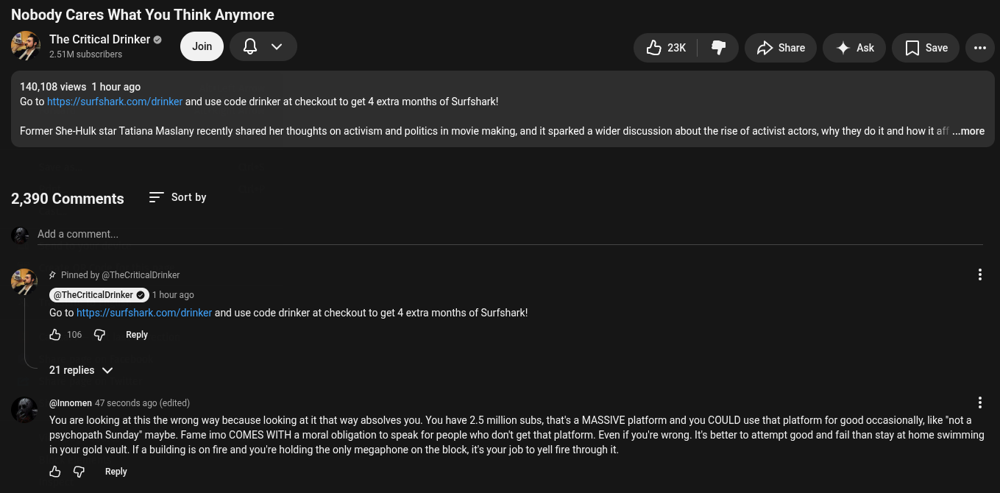

# Public Take transcript

## Machine transcription

Nobody Cares What You Think Anymore
The Critical Drinker
@) S e orinker @ Q v 2k & Dshae 4 Ak [Jsae o

140,108 views 1 hour ago
Go to hitps://surfshark com/drinker and use code drinker at checkout to get 4 extra months of Surfshark!

Former She-Hulk star Tatiana Maslany recently shared her thoughts on activism and politics in movie making, and it sparked a wider discussion about the rise of activist actors, why they do it and how it af ..more

2,390 Comments = Sortby

Add a comment.

# Pinned by @TheCritcalDrinker

TheCriticalDrinker © RIS

Go to hitps://surfshark.com/drinker and use code drinker at checkout to get 4 extra months of Surfshark!

&6 @ Repy

21 replies v/

@innomen 47 seconds ago (edited)

You are looking at this the wrong way because looking at it that way absolves you. You have 2.5 million subs, that's a MASSIVE platform and you COULD use that platform for good occasionally, ke ‘not a
psychopath Sunday” maybe. Fame imo COMES WITH a moral obligation to speak for people who donit get that platform. Even if you're wrong. Its better to attempt good and fail than stay at home swimming
in your gold vault. If a building is on fire and you're holding the only megaphone on the block, it your job to yell ire through it.

& G Reply
