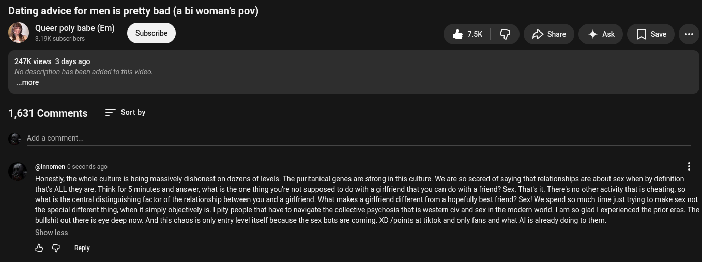

# Public Take transcript

## Machine transcription

Dating advice for men is pretty bad (a bi woman's pov)

Queer poly babe (Em)

sul
3.19K subscribers

be A /> Share 4 Ask [Jsave -

247K views 3 days ago
No description has been added to this video,
..more

1,631 Comments = Sortby

Add a comment.

@innomen 0 seconds ago

Honestly, the whole culture is being massively dishonest on dozens of levels. The puritanical genes are strong in this culture. We are o scared of saying that relationships are about sex when by definition
that's AL they are. Think for § minutes and answer, what s the one thing you're not supposed to do with a girlfriend that you can do with a friend? Sex. That's it. There's no other activity that is cheating, so
what is the central distinguishing factor of the relationship between you and a girlfriend. What makes a girlfriend different from a hopefully best friend? Sex! We spend so much time just trying to make sex not
the special different thing, when it simply objectively is. | pity people that have to navigate the collective psychosis that is western civ and sex in the modem world. | am so glad | experienced the prior eras. The

bullshit out there is eye deep now. And this chaos is only entry level tself because the sex bots are coming. XD /points at tiktok and only fans and what Al is already doing to them.
Show less

& G Reply
