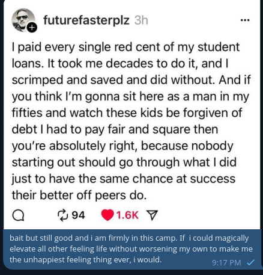

# Public Take transcript

## Machine transcription

D
o
<o futurefasterplz

| paid every single red cent of my student
loans. It took me decades to do it, and |
scrimped and saved and did without. And if
you think I'm gonna sit here as a man in my
fifties and watch these kids be forgiven of
debt I had to pay fair and square then
you're absolutely right, because nobody
starting out should go through what | did
just to have the same chance at success
their better off peers do.

Q 94 v
