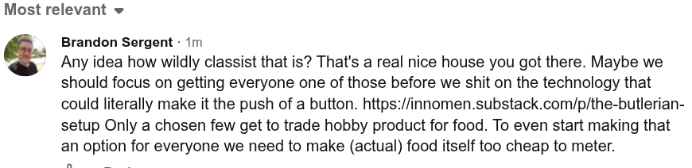

# Public Take transcript

## Machine transcription

Most relevant «

Brandon Sergent - 1m

* Any idea how wildly classist that is? That's a real nice house you got there. Maybe we
should focus on getting everyone one of those before we shit on the technology that
could literally make it the push of a button. https://innomen.substack.com/p/the-butlerian-
setup Only a chosen few get to trade hobby product for food. To even start making that
an option for everyone we need to make (actual) food itself too cheap to meter.
