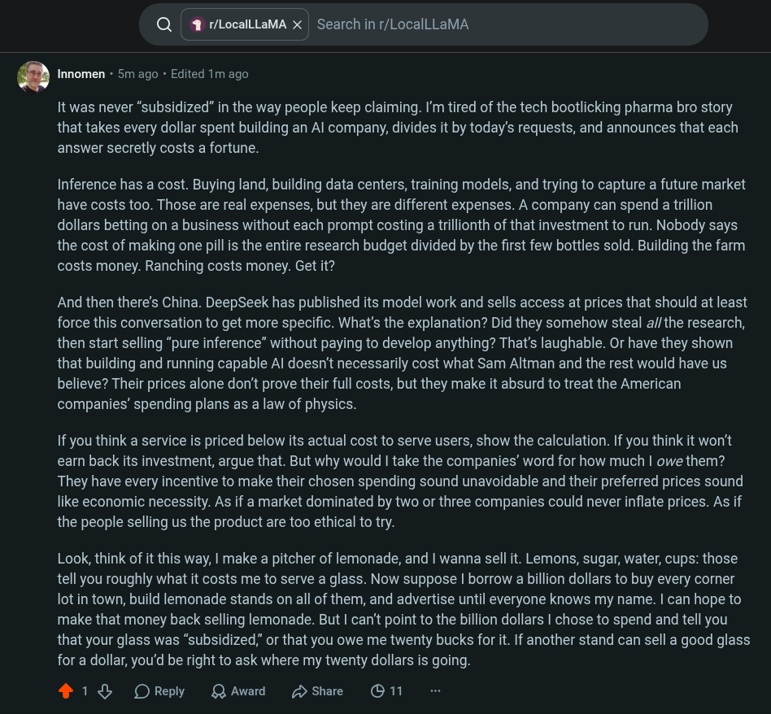

# Public Take transcript

## Machine transcription

Q | 4 r/LocalllaMA X | Search in r/LocalLLaMA

. Innomen - 5m ago - Edited 1m ago

It was never “subsidized” in the way people keep claiming. I'm tired of the tech bootlicking pharma bro story
that takes every dollar spent building an Al company, divides it by today’s requests, and announces that each
answer secretly costs a fortune.

Inference has a cost. Buying land, building data centers, training models, and trying to capture a future market
have costs too. Those are real expenses, but they are different expenses. A company can spend a trillion
dollars betting on a business without each prompt costing a trillionth of that investment to run. Nobody says
the cost of making one pill is the entire research budget divided by the first few bottles sold. Building the farm
costs money. Ranching costs money. Get it?

And then there’s China. DeepSeek has published its model work and sells access at prices that should at least
force this conversation to get more specific. What's the explanation? Did they somehow steal af/the research,
then start selling “pure inference” without paying to develop anything? That's laughable. Or have they shown
that building and running capable Al doesn't necessarily cost what Sam Altman and the rest would have us
believe? Their prices alone don’t prove their full costs, but they make it absurd to treat the American
companies’ spending plans as a law of physics.

If you think a service is priced below its actual cost to serve users, show the calculation. If you think it won't
earn back its investment, argue that. But why would | take the companies’ word for how much | owe them?
They have every incentive to make their chosen spending sound unavoidable and their preferred prices sound
like economic necessity. As if a market dominated by two or three companies could never inflate prices. As if
the people selling us the product are too ethical to try.

Look, think of it this way, | make a pitcher of lemonade, and | wanna sell it. Lemons, sugar, water, cups: those
tell you roughly what it costs me to serve a glass. Now suppose | borrow a billion dollars to buy every corner
lot in town, build lemonade stands on all of them, and advertise until everyone knows my name. | can hope to
make that money back selling lemonade. But | can't point to the billion dollars | chose to spend and tell you
that your glass was “subsidized,” or that you owe me twenty bucks for it. If another stand can sell a good glass
for a dollar, you'd be right to ask where my twenty dollars is going.

418 OReply QAwad Hshae O 11
