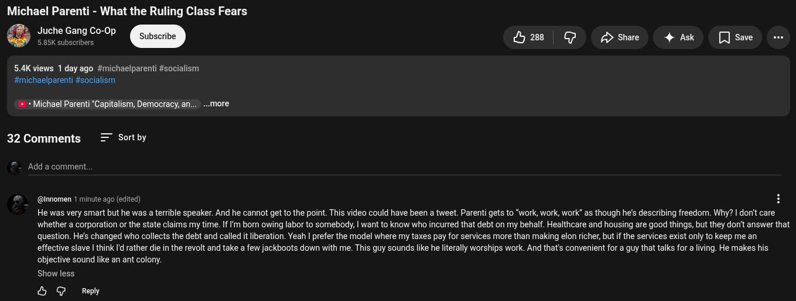

# Public Take transcript

## Machine transcription

Michael Parenti - What the Ruling Class Fears
Juche Gang Co-0p o
5.85K subscribers

5.4K views 1 day ago #michaelparenti #socialism
#michaelparenti #socialism

be

'+ + Michael Parenti "Capitalism, Democracy, an... ...more

32 Comments = Sortby

Add a comment.

@nnomen 1 minute ago (edited)

He was very smart but he was aterrible speaker. And he cannot get to the point. This video could have been a tweet. Parenti gets to “work, work, work" as though he's describing freedom. Why? | donit care

/288 C3 A share 4 Ak []Save e

whether a corporation or the state claims my time. If ' born owing labor to somebody, | want to know who incurred that debt on my behalf. Healthare and housing are good things, but they don't answer that
question. He's changed who collects the debt and called it liberation. Yeah | prefer the model where my taxes pay for services more than making elon richer, but if the services exist only to keep me an
effective slave | think Id rather die in the revolt and take a few jackboots down with me. This guy sounds like he literally worships work. And that's convenient for a guy that talks for a iving. He makes his

objective sound like an ant colony.
Show less

O @ Reply
