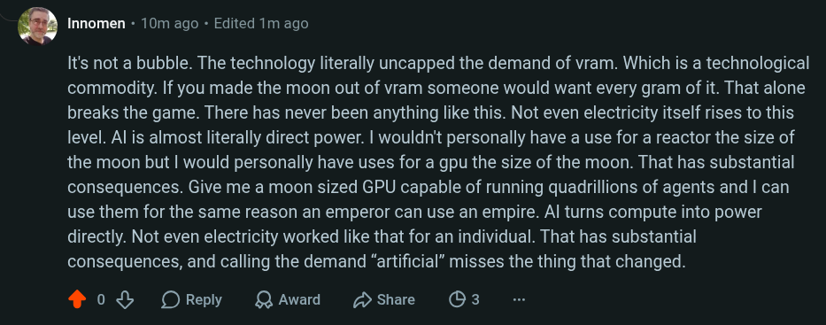

# Public Take transcript

## Machine transcription

’ Innomen - 10m ago - Edited 1m ago

It's not a bubble. The technology literally uncapped the demand of vram. Which is a technological
commodity. If you made the moon out of viam someone would want every gram of it. That alone
breaks the game. There has never been anything like this. Not even electricity itself rises to this
level. Al is almost literally direct power. | wouldn't personally have a use for a reactor the size of
the moon but | would personally have uses for a gpu the size of the moon. That has substantial
consequences. Give me a moon sized GPU capable of running quadrillions of agents and | can
use them for the same reason an emperor can use an empire. Al turns compute into power
directly. Not even electricity worked like that for an individual. That has substantial
consequences, and calling the demand “artificial” misses the thing that changed.

208 OReply QAward shae (O3
