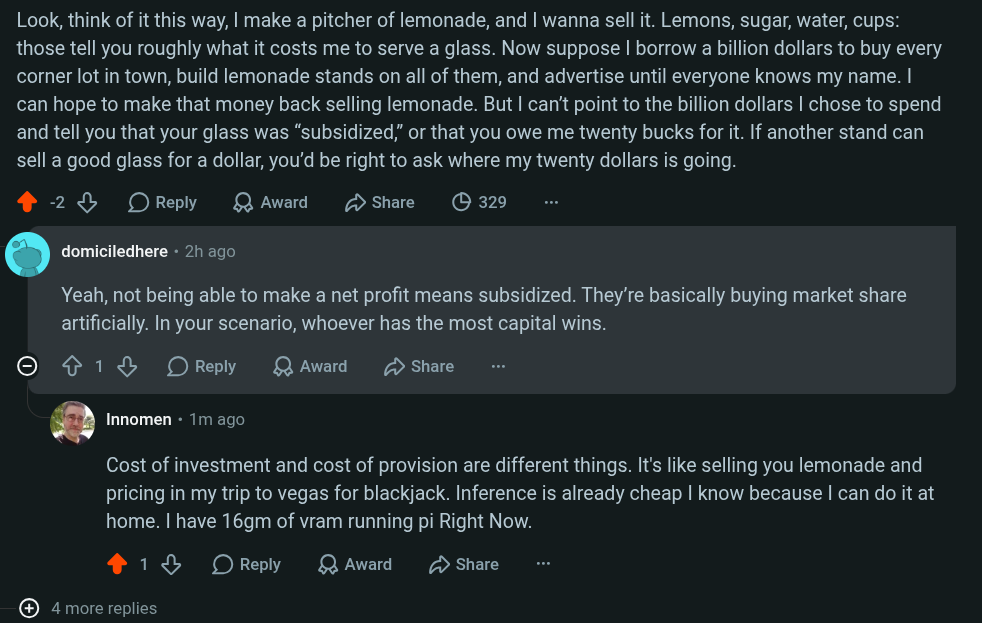

# Public Take transcript

## Machine transcription

Look, think of it this way, | make a pitcher of lemonade, and | wanna sell it. Lemons, sugar, water, cups:
those tell you roughly what it costs me to serve a glass. Now suppose | borrow a billion dollars to buy every
corner lot in town, build lemonade stands on all of them, and advertise until everyone knows my name. |
can hope to make that money back selling lemonade. But | can't point to the billion dollars | chose to spend
and tell you that your glass was “subsidized,” or that you owe me twenty bucks for it. If another stand can
sell a good glass for a dollar, you'd be right to ask where my twenty dollars is going.

® 28 OReply QAwad DShare (O 329

' domiciledhere - 2h ago

Yeah, not being able to make a net profit means subsidized. They're basically buying market share
artificially. In your scenario, whoever has the most capital wins.

O ¢ 1L OReply QAward 2 Share

a Innomen - 1m ago

Cost of investment and cost of provision are different things. It's like selling you lemonade and
pricing in my trip to vegas for blackjack. Inference is already cheap | know because | can do it at
home. | have 16gm of vram running pi Right Now.

418 OReply QAward D Share

@ 4 more replies
