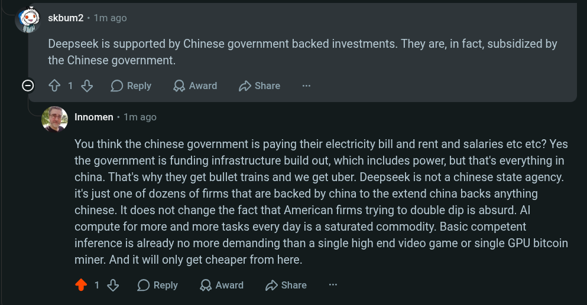

# Public Take transcript

## Machine transcription

9 skbumz - 1m ago

Deepseek is supported by Chinese government backed investments. They are, in fact, subsidized by
the Chinese government.

O ¢ 1L OReply QAward 2 Share

‘ Innomen - 1m ago

You think the chinese government is paying their electricity bill and rent and salaries etc etc? Yes
the government is funding infrastructure build out, which includes power, but that's everything in
china. That's why they get bullet trains and we get uber. Deepseek is not a chinese state agency.
it's just one of dozens of firms that are backed by china to the extend china backs anything
chinese. It does not change the fact that American firms trying to double dip is absurd. Al
compute for more and more tasks every day is a saturated commodity. Basic competent
inference is already no more demanding than a single high end video game or single GPU bitcoin
miner. And it will only get cheaper from here.

418 OReply QAward D Share
