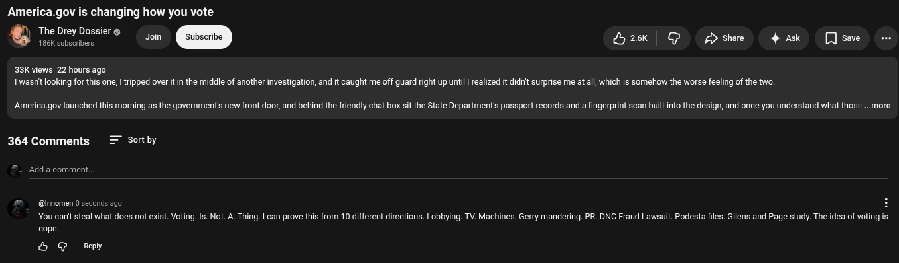

# Public Take transcript

## Machine transcription

America.gov is changing how you vote

TheDreyDossiers . @
186K subscr

y2ek | G g share 4 Ask [Jsave o

33K views 22 hours ago
1wasnit looking for this one, | tripped over it in the middle of another investigation, and it caught me off guard right up until I realized it didit surprise me at al, which is somehow the worse feeling of the two.

America gov launched this morning as the governments new front door, and behind the friendly chat box sit the State Department’s passport records and a fingerprint scan builtinto the design, and once you understand what thos ...more

364 Comments = sortby

‘Add a comment,

@ @imomen 0 seconds ago
‘You cant steal what does not exist. Voting. Is. Not. A. Thing. | can prove this from 10 different directions. Lobbying. TV. Machines. Gerry mandering. PR. DNC Fraud Lawsuit. Podesta files. Gilens and Page study. The idea of voting is

cope.
& G Ry
