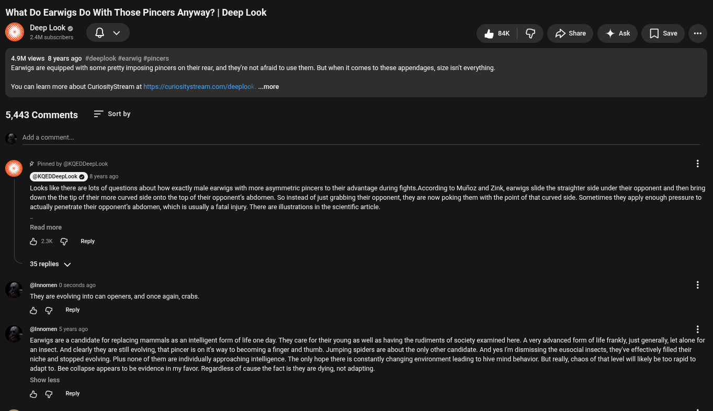

# Public Take transcript

## Machine transcription

What Do Earwigs Do With Those

cers Anyway?
®e oo 4w O Som Ak e -

Deep Look

4.9M views 8 years ago #deeplook #eanwig #pincers
Earwigs are equipped with some pretty imposing pincers on their rear, and theyre not afraid to use them. But when it comes to these appendages, size isn't everything.

You can leam more abourt CuriosityStream at htips://curiositystrearm com/deeplock ..more

5,443 Comments = Sortby

‘Add a comment,

by @KQED!

pLook © RRCHES

Looks ke there e lots of questions about how exactly male earwigs with more asymmetric pincers to their advantage during fights According to Mufioz and Zink, earwigs slide the straighter side under their opponent and then bring
down the the tip of their more curved side onto the top of their opponent’s abdomen. So instead of just grabbing their opponent,they are now poking them with the point of that curved side. Sometimes they apply enough pressure to
actually penetrate their opponent's abdomen, which is usually a fatal injury. There are illustrations n the scientific artcle.

Read more

& 2K G Reply
35 replies v

@innomen 0 seconds ago

“They are evolving into can openers, and once again, crabs.
& G Ry

@innomen 5 years ago 4

Earwigs are a candidate for replacing mammals as an intelligent form of life one day. They care for their young as well as having the rudiments of society examined here. A very advanced form oflfe frankly just generally,let alone for
aninsect. And clearly they are stil evolving, that pincer is on it's way to becoming a finger and thumb. Jumping spiders are about the only other candidate. And yes I'm dismissing the eusocial insects, they ve effectively filled their
niche and stopped evolving. Plus none of them are individually approaching intelligence. The only hope there is constantly changing environment leading to hive mind behavior. But really, chaos of that level will liely be to rapid to
adaptto. Bee collapse appears to be evidence in my favor. Regardless of cause the fact s they are dying, not adapting.

show less

& G Redy
