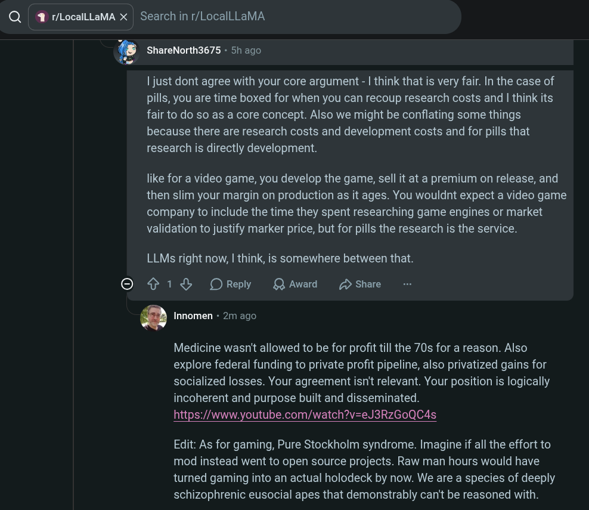

# Public Take transcript

## Machine transcription

Q | 1 r/LocallLaMA X | Search in r/LocalLLaMA

8 ShareNorth3675 - 5h ago

| just dont agree with your core argument - | think that is very fair. In the case of
pills, you are time boxed for when you can recoup research costs and | think its
fair to do so as a core concept. Also we might be conflating some things
because there are research costs and development costs and for pills that
research is directly development.

like for a video game, you develop the game, sell it at a premium on release, and
then slim your margin on production as it ages. You wouldnt expect a video game
company to include the time they spent researching game engines or market
validation to justify marker price, but for pills the research is the service.

LLMs right now, | think, is somewhere between that.

O 1% OReply QAward 2 Share

@ Innomen - 2m ago

Medicine wasn't allowed to be for profit till the 70s for a reason. Also
explore federal funding to private profit pipeline, also privatized gains for
socialized losses. Your agreement isn't relevant. Your position is logically
incoherent and purpose built and disseminated.
https://www.youtube.com/watch?v=eJ3RzGoQC4s

Edit: As for gaming, Pure Stockholm syndrome. Imagine if all the effort to
mod instead went to open source projects. Raw man hours would have
turned gaming into an actual holodeck by now. We are a species of deeply
schizophrenic eusocial apes that demonstrably can't be reasoned with.
