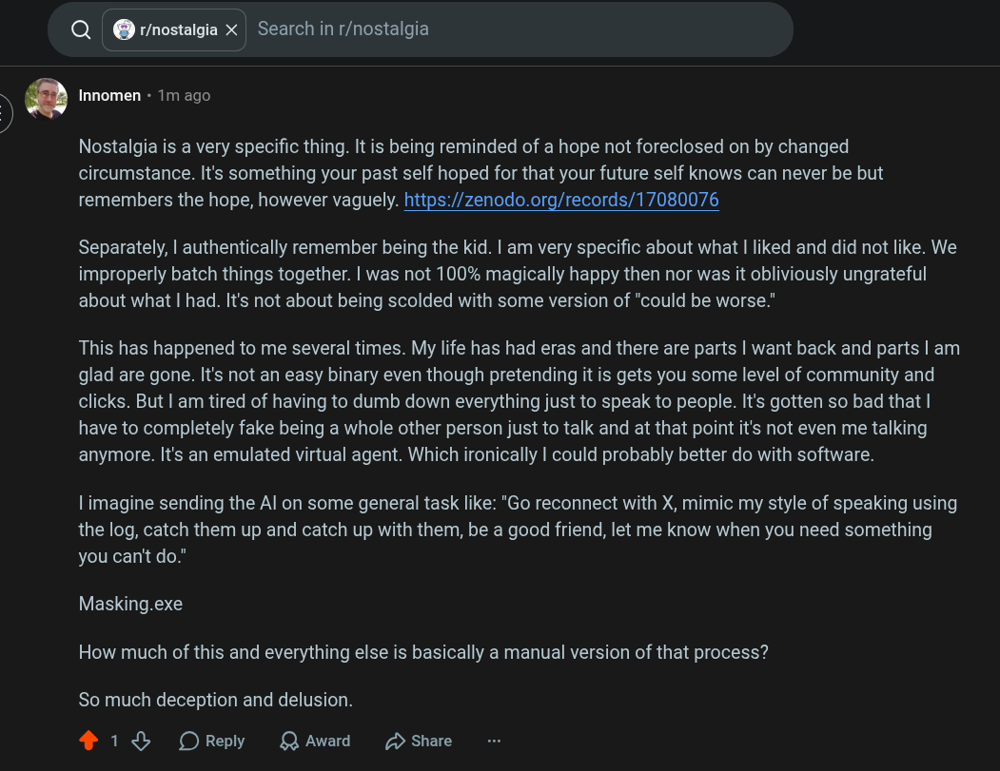

# Public Take transcript

## Machine transcription

N

)
/

Q @ r/nostalgia X Search in r/nostalgia

a Innomen - 1m ago

Nostalgia is a very specific thing. It is being reminded of a hope not foreclosed on by changed
circumstance. It's something your past self hoped for that your future self knows can never be but
remembers the hope, however vaguely. https://zenodo.org/records/17080076

Separately, | authentically remember being the kid. | am very specific about what | liked and did not like. We
improperly batch things together. | was not 100% magically happy then nor was it obliviously ungrateful
about what | had. It's not about being scolded with some version of "could be worse."

This has happened to me several times. My life has had eras and there are parts | want back and parts | am
glad are gone. It's not an easy binary even though pretending it is gets you some level of community and
clicks. But | am tired of having to dumb down everything just to speak to people. It's gotten so bad that |
have to completely fake being a whole other person just to talk and at that point it's not even me talking
anymore. It's an emulated virtual agent. Which ironically | could probably better do with software.

| imagine sending the Al on some general task like: "Go reconnect with X, mimic my style of speaking using
the log, catch them up and catch up with them, be a good friend, let me know when you need something
you can't do."

Masking.exe
How much of this and everything else is basically a manual version of that process?

So much deception and delusion.

413 OReply QAwad D Share
