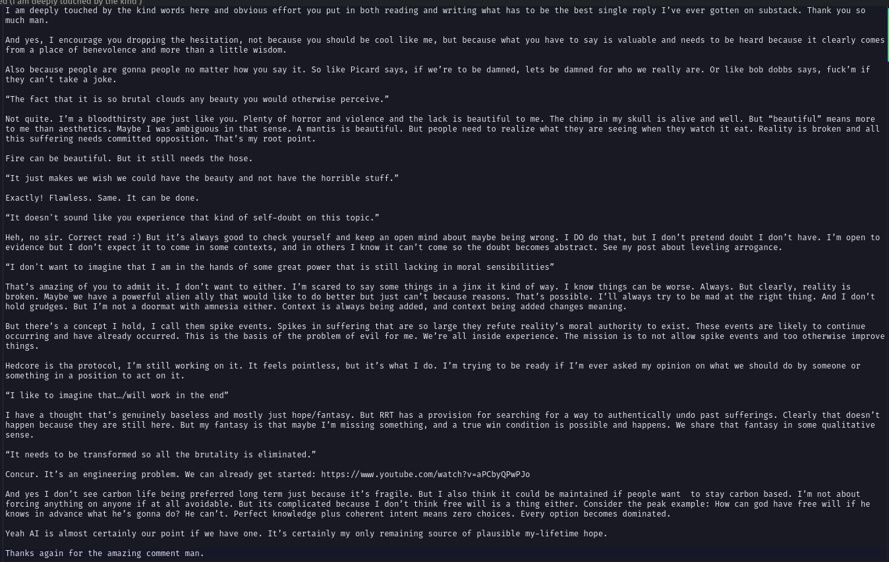

# Public Take transcript

## Machine transcription

e\ el EERTY BRI Y R R
T am deeply touched by the kind words here and obvious effort you put in both reading and writing what has to be the best single reply I've ever gotten on substack. Thank you so
much man.

And yes, T encourage you dropping the hesitation, not because you should be cool like me, but because what you have to say is valuable and needs to be heard because it clearly comes
from a place of benevolence and more than a little wisdom.

Also because people are gonna people no matter how you say it. So like Picard says, if we're to be damned, lets be damned for who we really are. Or like bob dobbs says, fuck’m if
they can’t take a joke.

“The fact that it is so brutal clouds any beauty you would otherwise perceive
Not quite. I'm a bloodthirsty ape just like you. Plenty of horror and violence and the lack is beautiful to me. The chimp in my skull is alive and well. But “beautiful” means more
to me than aesthetics. Maybe I was ambiguous in that sense. A mantis is beautiful. But people need to realize what they are seeing when they watch it eat. Reality is broken and all
this suffering needs conmitted opposition. That’s my root point.

Fire can be beautiful. But it still needs the hose.

“It just makes we wish we could have the beauty and not have the horrible stuff.”

Exactly! Flawless. Same. It can be done.

“It doesn't sound like you experience that kind of self-doubt on this topic.”

Heh, no sir. Correct read :) But it's always good to check yourself and keep an open mind about maybe being wrong. I DO do that, but I don’t pretend doubt I don’t have. I'm open to
evidence but T don’t expect it to come in some contexts, and in others I know it can’t come so the doubt becomes abstract. See my post about leveling arrogance.

“I don't want to imagine that T am in the hands of some great power that is still lacking in moral sensibilities”
That's amazing of you to admit it. T don’t want to either. I'm scared to say some things in a jinx it kind of way. T know things can be worse. Always. But clearly, reality is
broken. Maybe we have a powerful alien ally that would like to do better but just can’t because reasons. That's possible. I'll always try to be mad at the right thing. And T don’t
hold grudges. But I'm not a doormat with amnesia either. Context is always being added, and context being added changes meaning.

But there’s a concept I hold, T call them spike events. Spikes in suffering that are so large they refute reality’s moral authority to exist. These events are likely to continue
occurring and have already occurred. This is the basis of the problem of evil for me. We're all inside experience. The mission is to not allow spike events and too otherwise improve
things.

Hedcore is tha protocol, I'm still working on it. It feels pointless, but it’s what I do. I'm trying to be ready if I'm ever asked my opinion on what we should do by someone or
something in a position to act on it.

“I like to inagine that./will work in the end”
1 have a thought that's genuinely baseless and mostly just hope/fantasy. But RRT has a provision for searching for a way to authentically undo past sufferings. Clearly that doesn’t
happen because they are still here. But my fantasy is that maybe I'm missing something, and a true win condition is possible and happens. We share that fantasy in some qualitative
sense.

“It needs to be transformed so all the brutality is eliminated.”

Concur. Tt's an engineering problem. We can already get started: https://wmy.youtube.con/watch?

~aPCbyQPwPI0
And yes T don’t see carbon life being preferred long term just because it's fragile. But I also think it could be maintained if people want to stay carbon based. I'm not about
forcing anything on anyone if at all avoidable. But its complicated because I don’t think free will is a thing either. Consider the peak example: How can god have free will if he
knows in advance what he’s gonna do? He can’t. Perfect knowledge plus coherent intent means zero choices. Every option becomes dominated.

Yeah AT is almost certainly our point if we have one. It's certainly my only remaining source of plausible my-lifetime hope.

Thanks again for the amazing comment man.
