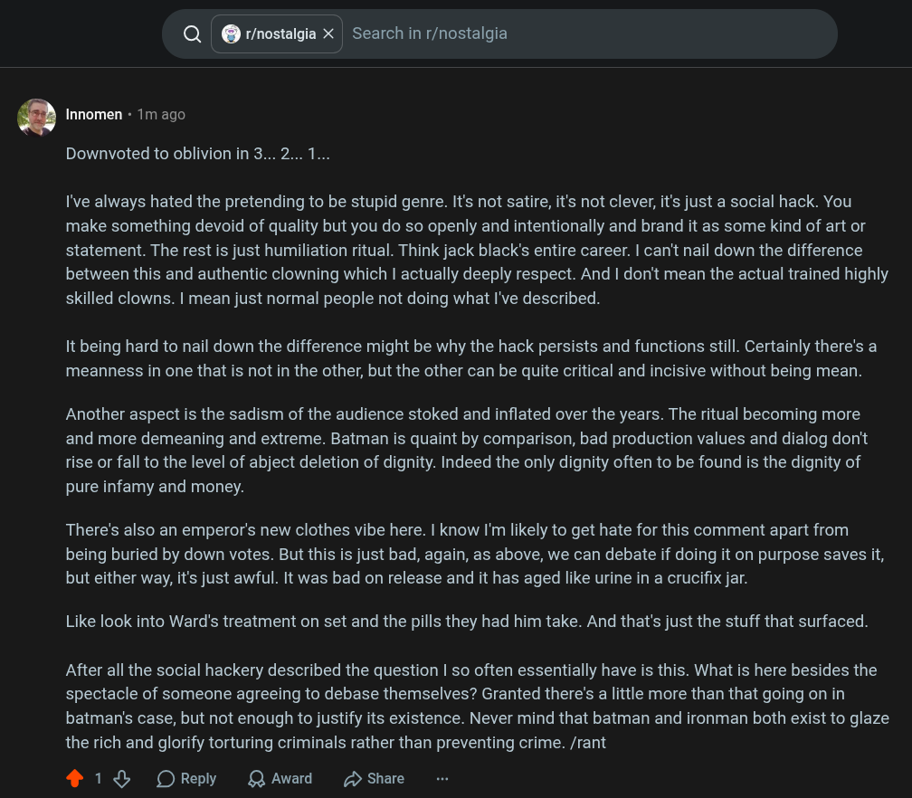

# Public Take transcript

## Machine transcription

Q @ r/nostalgia X | Search in r/nostalgia

Q Innomen « 1m ago

Downvoted to oblivionin 3... 2... 1...

I've always hated the pretending to be stupid genre. It's not satire, it's not clever, it's just a social hack. You
make something devoid of quality but you do so openly and intentionally and brand it as some kind of art or
statement. The rest is just humiliation ritual. Think jack black's entire career. | can't nail down the difference
between this and authentic clowning which | actually deeply respect. And | don't mean the actual trained highly
skilled clowns. | mean just normal people not doing what I've described.

It being hard to nail down the difference might be why the hack persists and functions still. Certainly there's a
meanness in one that is not in the other, but the other can be quite critical and incisive without being mean.

Another aspect is the sadism of the audience stoked and inflated over the years. The ritual becoming more
and more demeaning and extreme. Batman is quaint by comparison, bad production values and dialog don't
rise or fall to the level of abject deletion of dignity. Indeed the only dignity often to be found is the dignity of
pure infamy and money.

There's also an emperor's new clothes vibe here. I know I'm likely to get hate for this comment apart from
being buried by down votes. But this is just bad, again, as above, we can debate if doing it on purpose saves it,
but either way, it's just awful. It was bad on release and it has aged like urine in a crucifix jar.

Like look into Ward's treatment on set and the pills they had him take. And that's just the stuff that surfaced.

After all the social hackery described the question | so often essentially have is this. What is here besides the
spectacle of someone agreeing to debase themselves? Granted there's a little more than that going on in
batman's case, but not enough to justify its existence. Never mind that batman and ironman both exist to glaze
the rich and glorify torturing criminals rather than preventing crime. /rant

418 OReply QAward 2 Share
