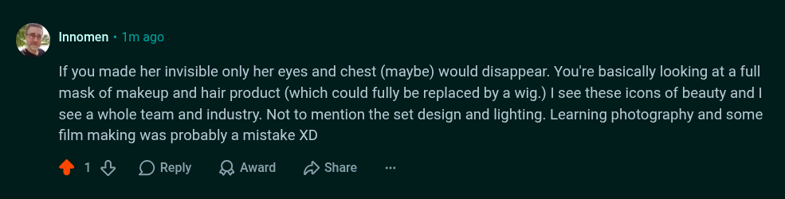

# Public Take transcript

## Machine transcription

. Innomen - 1m ago

If you made her invisible only her eyes and chest (maybe) would disappear. You're basically looking at a full
mask of makeup and hair product (which could fully be replaced by a wig.) | see these icons of beauty and |
see a whole team and industry. Not to mention the set design and lighting. Learning photography and some
film making was probably a mistake XD

418 OReply QAward 2 Share
