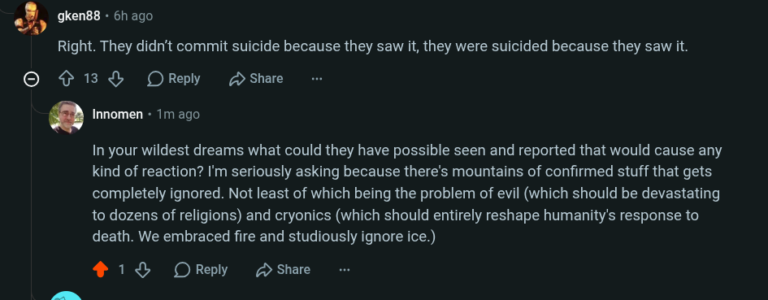

# Public Take transcript

## Machine transcription

%2, gken88 - 6h ago

Right. They didn‘t commit suicide because they saw it, they were suicided because they saw it.

© ¢ 13&% ORely D share

’ Innomen - 1m ago

In your wildest dreams what could they have possible seen and reported that would cause any
kind of reaction? I'm seriously asking because there's mountains of confirmed stuff that gets

completely ignored. Not least of which being the problem of evil (which should be devastating
to dozens of religions) and cryonics (which should entirely reshape humanity's response to
death. We embraced fire and studiously ignore ice.)

418 OReply (D Share
