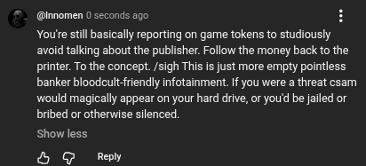

# Public Take transcript

## Machine transcription

@imomen 0 seconds ago.
You'e still basically reporting on game tokens to studiously
avoid talking about the publisher. Follow the money back to the
printer. Tothe concept. /sigh This is just more empty pointless
banker bloodcult-friendly infotainment. If you were a threat csam
would magically appear on your hard drive, or youd be jailed or
bribed or otherwise silenced

Show less

& G Rey
