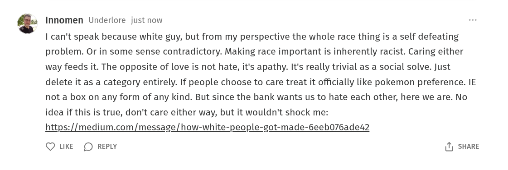

# Public Take transcript

## Machine transcription

Innomen Underlore just now

| can't speak because white guy, but from my perspective the whole race thing is a self defeating
problem. Or in some sense contradictory. Making race important is inherently racist. Caring either
way feeds it. The opposite of love is not hate, it's apathy. It's really trivial as a social solve. Just
delete it as a category entirely. If people choose to care treat it officially like pokemon preference. IE
not a box on any form of any kind. But since the bank wants us to hate each other, here we are. No
idea if this is true, don't care either way, but it wouldn't shock me:
https://medium.com/message/how-white-people-got-made-6eeb076ade42

Q LKE (D REPLY 1) SHARE
