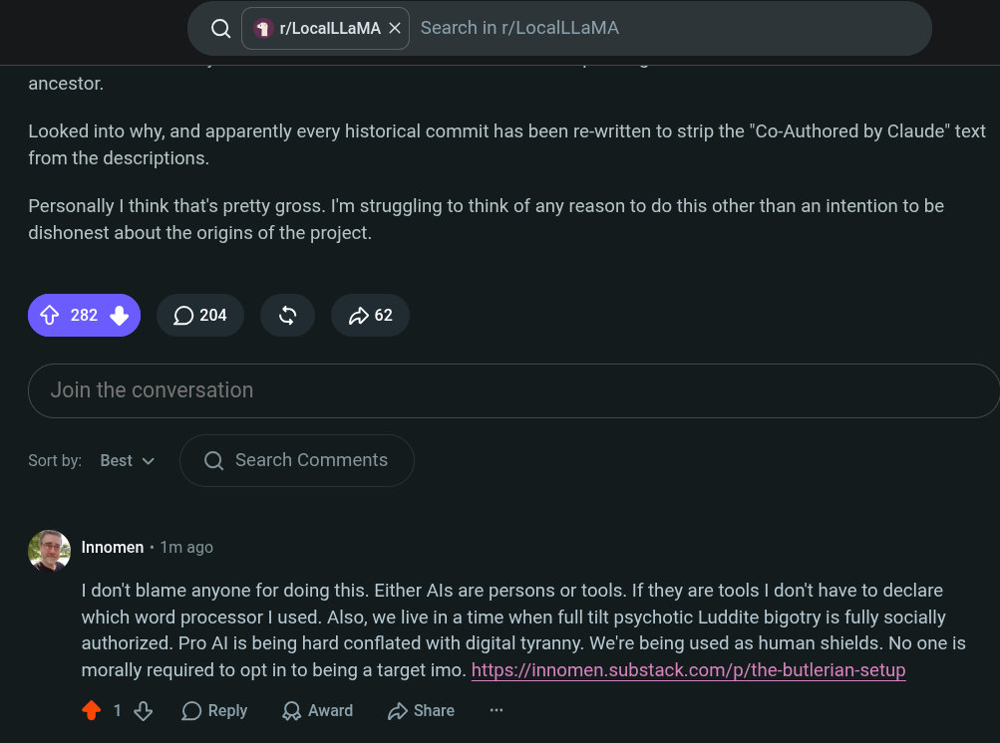

# Public Take transcript

## Machine transcription

Q | 4 r/localllaMA X | Search in r/LocalLLaMA

ancestor.

Looked into why, and apparently every historical commit has been re-written to strip the "Co-Authored by Claude" text
from the descriptions.

Personally | think that's pretty gross. I'm struggling to think of any reason to do this other than an intention to be
dishonest about the origins of the project.

Join the conversation

Sortby: Best v Q Search Comments

. Innomen + 1m ago

I don't blame anyone for doing this. Either Als are persons or tools. If they are tools | don't have to declare
which word processor | used. Also, we live in a time when full tilt psychotic Luddite bigotry is fully socially
authorized. Pro Al is being hard conflated with digital tyranny. We're being used as human shields. No one is
morally required to opt in to being a target imo. https://innomen.substack.com/p/the-butlerian-setup

418 OReply QAward /2 Share
