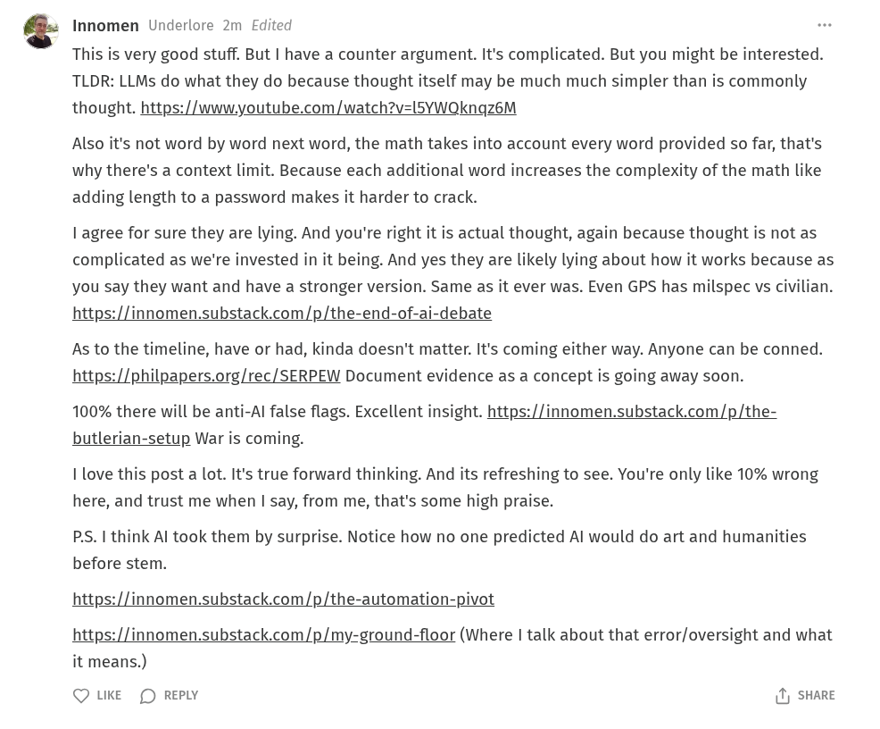

# Public Take transcript

## Machine transcription

Innomen Underlore 2m Edited

This is very good stuff. But | have a counter argument. It's complicated. But you might be interested.
TLDR: LLMs do what they do because thought itself may be much much simpler than is commonly
thought. https://www.youtube.com/watch?v=l5YWQknqgz6M

Also it's not word by word next word, the math takes into account every word provided so far, that's
why there's a context limit. Because each additional word increases the complexity of the math like
adding length to a password makes it harder to crack.

| agree for sure they are lying. And you're right it is actual thought, again because thought is not as
complicated as we're invested in it being. And yes they are likely lying about how it works because as
you say they want and have a stronger version. Same as it ever was. Even GPS has milspec vs civilian.
https://innomen.substack.com/p/the-end-of-ai-debate

As to the timeline, have or had, kinda doesn't matter. It's coming either way. Anyone can be conned.
https://philpapers.org/rec/SERPEW Document evidence as a concept is going away soon.

100% there will be anti-Al false flags. Excellent insight. https://innomen.substack.com/p/the-
butlerian-setup War is coming.

I love this post a lot. It's true forward thinking. And its refreshing to see. You're only like 10% wrong
here, and trust me when | say, from me, that's some high praise.

P.S. I think Al took them by surprise. Notice how no one predicted Al would do art and humanities
before stem.

https://innomen.substack.com/p/the-automation-pivot

https://innomen.substack.com/p/my-ground-floor (Where | talk about that error/oversight and what
it means.)

Q UKE (D REPLY (1) SHARE
