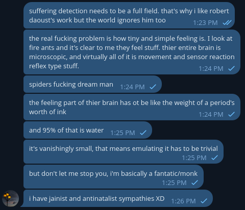

# Public Take transcript

## Machine transcription

suffering detection needs to be a full ield. that's why i like robert
daoust's work but the world ignores him too M

the real fucking problem is how tiny and simple feeling . T look at
fire ants and it's clear to me they feel stuff. thier entire brain is

microscopic, and virtually all of it is movement and sensor reaction
reflex type stuff. 124PM v

spiders fucking dream man ;.54 pyy o/

the feeling part of thier brain has ot be like the weight of a period's
worth of ink 124PM

and 95% of that is water M v

it's vanishingly small, that means emulating it has to be trivial

but don't let me stop you, im basically a fantatic/monk
125PM

i have jainist and antinatalist sympathies XD
