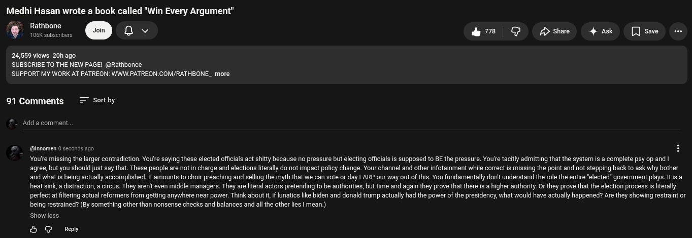

# Public Take transcript

## Machine transcription

Medhi Hasan wrote a book called "Win Every Argument"
¥ @ Qv &8 @ Dshae  4ak  [Jsae -

24,559 views 20h ago
'SUBSCRIBE TO THE NEW PAGE! @Rathbonee
'SUPPORT MY WORK AT PATREON: WWW.PATREON.COM/RATHBONE more

91Comments = Sertby

‘Add a comment,

@ @imomen0
You're missing the larger contradiction. You'e saying these elected offiials act shitty because no pressure but electing officials is supposed to BE the pressure. Youre tacitly admitting that the system is a complete psy op and |
agree, but you should just say that. These people are not in charge and elections literally do not impact policy change. Your channel and other infotainment while correct is missing the point and not stepping back to ask why bother
and what is being actually accomplished. It amounts to choir preaching and selling the myth that we can vote or day LARP our way out of this. You fundamentally don't understand the role the entire "elected” govemment plays. Itis a
heat sink, a distraction, a circus. They arerit even middle managers. They are lteral actors pretending to be authorities, but time and again they prove that there is a higher authority. Or they prove that the election process isliterally
perfect at filtering actual reformers from getting anywhere near power. Think about i, if lunatics like biden and donald trump actually had the power of the presidency, what would have actually happened? Are they showing restraint or
being restrained? (By something other than nonsense checks and balances and allthe other lies | mean.)

nds ago

show less

& G Ry
