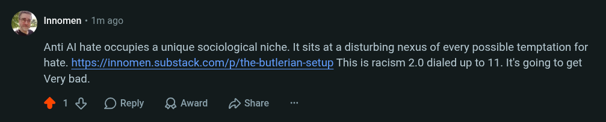

# Public Take transcript

## Machine transcription

' Innomen - 1m ago

Anti Al hate occupies a unique sociological niche. It sits at a disturbing nexus of every possible temptation for
hate. https://innomen.substack.com/p/the-butlerian-setup This is racism 2.0 dialed up to 11. It's going to get
Very bad.

4 18% OReply QAward D Share
